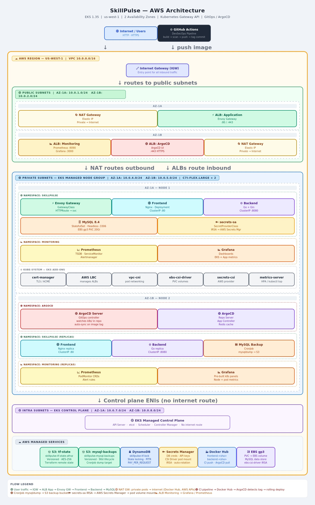

# SkillPulse — Deployment & Architecture Guide

> A production-grade three-tier application deployed on Amazon EKS with a fully automated DevSecOps pipeline, GitOps-driven delivery via ArgoCD, and one-command infrastructure lifecycle management.

---

## Table of Contents

- [Project Overview](#project-overview)
- [What Already Existed](#what-already-existed)
- [What Was Built & Upgraded](#what-was-built--upgraded)
- [Technology Stack](#technology-stack)
- [Prerequisites](#prerequisites)
- [Repository Structure](#repository-structure)
- [Architecture](#architecture)
  - [Infrastructure Architecture](#infrastructure-architecture)
  - [Architecture Diagram](#architecture-diagram)
  - [CI/CD Pipeline Architecture](#cicd-pipeline-architecture)
  - [Traffic Flow](#traffic-flow)
- [Infrastructure Deep Dive](#infrastructure-deep-dive)
  - [Remote State Backend](#remote-state-backend)
  - [EKS Cluster](#eks-cluster)
  - [Helm Charts & Add-ons](#helm-charts--add-ons)
  - [IAM Roles & Service Accounts](#iam-roles--service-accounts)
  - [Load Balancers](#load-balancers)
- [DevSecOps Pipeline](#devsecops-pipeline)
  - [Code Quality](#code-quality)
  - [Dependency Scanning](#dependency-scanning)
  - [Secrets Scanning](#secrets-scanning)
  - [Dockerfile Linting](#dockerfile-linting)
  - [Image Scanning](#image-scanning)
  - [Build & Push](#build--push)
  - [Orchestrator Workflow](#orchestrator-workflow)
- [GitOps with ArgoCD](#gitops-with-argocd)
- [Makefile — One-Command Operations](#makefile--one-command-operations)
- [Deployment: Step-by-Step](#deployment-step-by-step)
- [Teardown: Step-by-Step](#teardown-step-by-step)
- [Secrets & Environment Variables](#secrets--environment-variables)
- [Monitoring & Observability](#monitoring--observability)

---

## Project Overview

**SkillPulse** is a three-tier web application that lets users track skills they are learning and the hours invested. The application itself is intentionally lightweight: a Go backend, a vanilla JavaScript frontend served by Nginx, and a MySQL database.

The main value of this repository is the platform around the application: secure infrastructure provisioning, GitOps-based delivery, automated security gates, secret management, and repeatable one-command deployment.

---

## What Already Existed

The upstream repository, forked from `LondheShubham153/github-actions-kubernetes-masterclass`, provided the baseline application and a simple delivery path.

It already included:
- A Dockerfile for the Go backend.
- A Dockerfile for the Nginx-served frontend.
- A `docker-compose.yml` for local three-tier development.
- A basic CI/CD pipeline that SSH'd into a server and ran `docker compose up` on every push to `main`.

Everything described in the sections below was designed, built, and integrated on top of that starting point.

---

## What Was Built & Upgraded

### Infrastructure as Code

I added a complete Terraform-based infrastructure layer with two major parts:

- `state-backend/` — a bootstrappable Terraform module that creates:
  - An S3 bucket for remote Terraform state.
  - A DynamoDB table for state locking.
  - A separate S3 bucket for MySQL backup storage.
- `terraform/` — the main infrastructure layer that provisions:
  - An Amazon EKS cluster with managed node groups.
  - VPC, subnets, route tables, and security groups.
  - IAM and IRSA roles for workload-level AWS access.
  - Helm-managed add-ons for ingress, GitOps, certificates, monitoring, and secret injection.
  - Terraform workspaces for dev, staging, and prod, allowing the same infrastructure code to be promoted across environments with separate state files.

### Cluster Add-ons

The cluster now installs and manages these components through Terraform Helm releases:
- Envoy Gateway.
- cert-manager.
- ArgoCD.
- kube-prometheus-stack.
- Secrets Store CSI AWS provider.

### Load Balancing

The deployment uses three load balancers in the final architecture:
- One application ingress load balancer created when the Gateway API `GatewayClass` is applied.
- One load balancer for ArgoCD.
- One load balancer for monitoring access to Grafana and Prometheus.

### Secrets Management

I introduced AWS Secrets Manager for MySQL credentials and connected it to Kubernetes through the Secrets Store CSI Driver with the AWS provider. The database credentials are injected into the cluster without storing plaintext secrets in Git.

### DevSecOps Pipeline

The CI/CD pipeline was upgraded from a single SSH-based deploy job into a multi-stage DevSecOps pipeline with security gates:
- Code quality checks.
- Dependency scanning.
- Secrets scanning.
- Dockerfile linting.
- Image vulnerability scanning.
- Docker build and push.
- Automatic image tag updates in Kubernetes manifests.
- A final orchestrator workflow that invokes all stages in sequence.

### GitOps Delivery

ArgoCD now watches the Kubernetes manifests and continuously reconciles the cluster to the desired state. Any manifest update pushed to `main` is automatically synced into EKS.

### One-Command Operations

A single Makefile now controls the lifecycle:
- `make bootstrap` for remote backend initialization.
- `make apply` for full infrastructure deployment.
- `make destroy` for full teardown.

---

## Technology Stack

| Layer | Technology |
|---|---|
| Cloud Provider | Amazon Web Services (AWS) |
| Container Orchestration | Amazon EKS |
| Infrastructure as Code | Terraform |
| Remote State | S3 + DynamoDB |
| GitOps / CD | ArgoCD |
| Ingress / Gateway | Envoy Gateway (Gateway API) |
| TLS Management | cert-manager |
| Monitoring | Prometheus + Grafana |
| CI/CD | GitHub Actions |
| Security Scanning | Trivy, Gitleaks, OWASP Dependency-Check, Hadolint |
| Container Registry | Docker Hub |
| Secrets Management | AWS Secrets Manager + Secrets Store CSI Driver |
| Application Backend | Go + Gin |
| Application Frontend | HTML, CSS, JavaScript + Nginx |
| Application Database | MySQL |
| Automation | GNU Make |

---

## Prerequisites

### Local Tools

Ensure the following tools are installed and available in your `PATH`:

| Tool | Purpose |
|---|---|
| `terraform` | Infrastructure provisioning |
| `aws` CLI | AWS API access and credential setup |
| `kubectl` | Kubernetes cluster interaction |
| `helm` | Helm chart management |
| `make` | Workflow automation |
| `git` | Source control |

### AWS Account Setup

Configure AWS credentials before deploying:

```bash
aws configure
# Enter Access Key ID, Secret Access Key, Region, and Output format
```

The IAM principal used for deployment must have permission to manage:
- S3 buckets and bucket policies.
- DynamoDB tables.
- EKS clusters and managed node groups.
- VPCs, subnets, and security groups.
- IAM roles and policies.
- Load balancers.
- Secrets Manager access.

### GitHub Repository Secrets

Add the following secrets under `Settings → Secrets and variables → Actions`:

| Secret | Description |
|---|---|
| `DOCKERHUB_USERNAME` | Docker Hub account username |
| `DOCKERHUB_TOKEN` | Docker Hub token with read/write access |

### AWS Secret Manager

Add the following secrets under `AWS secret manager → Store new secret → Other type of secret → Key/Value pairs`:

| Secret | Description |
|---|---|
| `MYSQL_ROOT_PASSWORD` | MYSQL root password |
| `MYSQL_DATABASE` | Add database name `skillpulse` |
| `MYSQL_USER` | User name for database |
| `MYSQL_PASSWORD` | Password for the created user |


---

## Repository Structure

```text
.
├── .github/
│   └── workflows/
│       ├── devsecops-pipeline.yml
│       ├── code-quality.yml
│       ├── dependency-scan.yml
│       ├── secrets-scan.yml
│       ├── dockerfile-lint.yml
│       ├── image-scan.yml
│       └── build-and-push.yml
├── argocd/
│   └── application.yaml
├── backend/
│   ├── Dockerfile
│   ├── main.go
│   ├── database/
│   └── handlers/
├── frontend/
│   ├── Dockerfile
│   ├── nginx.conf
│   └── index.html
├── k8s/
│   ├── 10-secret-provider-class.yaml
│   ├── 20-mysql.yaml
│   ├── 30-backend.yaml
│   ├── 40-frontend.yaml
│   ├── 50-hpa.yaml
│   ├── 60-cert-manager.yaml
│   ├── 70-gateway.yaml
│   └── 80-backup.yaml
├── mysql/
│   └── init.sql
├── state-backend/
│   ├── backend.tf
│   └── backup.tf
├── terraform/
│   ├── argocd.tf
│   ├── backup-use.tf
│   ├── cert.tf
│   ├── dev.tfvars
│   ├── eks.tf
│   ├── gateway.tf
│   ├── monitoring.tf
│   ├── outputs.tf
│   ├── prod.tfvars
│   ├── provider.tf
│   ├── secrets-store.tf
│   ├── staging.tfvars
│   ├── variables.tf
│   └── vpc.tf
├── docker-compose.yml
├── Makefile
├── .env.example
├── .trivyignore
└── .gitignore
```

---

## Architecture

### Infrastructure Architecture

The infrastructure is organized into three layers and deployed through Terraform workspaces for `dev`, `staging`, and `prod`:

1. Remote backend infrastructure for Terraform state and MySQL backups.
2. Core AWS infrastructure for networking, IAM, secrets, and EKS.
3. In-cluster services managed by Helm and Kubernetes manifests.

Each workspace maps to an isolated environment, so the same codebase can be promoted safely from development to staging and then to production without changing the backend configuration [web:23].

This separation keeps the platform reproducible, environment-aware, and easy to tear down and rebuild.

### Architecture Diagram

   

### CI/CD Pipeline Architecture

```text
Developer
  |
  | git push to main
  v
devsecops-pipeline.yml
  |
  +--> code-quality.yml
  +--> dependency-scan.yml
  +--> secrets-scan.yml
  +--> dockerfile-lint.yml
  +--> build-and-push.yml
  +--> image-scan.yml
  |
  v
Updated Kubernetes manifests committed to main
  |
  v
ArgoCD detects drift and syncs the cluster
```

### Traffic Flow

```text
User
  |
  v
Application Ingress Load Balancer
  |
  v
Envoy Gateway
  |
  +--> Frontend Service
  |
  +--> Backend Service
  |
  v
MySQL StatefulSet
```

Monitoring and GitOps traffic are exposed separately through their own management load balancers.

---

## Infrastructure Deep Dive

### Remote State Backend

Before any EKS infrastructure is created, the remote backend must be bootstrapped. This is a one-time operation.

The `state-backend/` module creates:
- An S3 bucket for Terraform state with versioning, AES-256 encryption, and public access blocked.
- A DynamoDB table for Terraform state locking and consistency.
- A dedicated S3 bucket for MySQL backup archives with lifecycle controls.

### EKS Cluster

The `terraform/` module provisions a production-style EKS cluster:
- Private node groups for application workloads.
- Managed node groups with configurable instance types and scaling bounds.
- An OIDC provider for IRSA.
- `aws-auth` configuration for cluster access control.
- The Terraform configuration is workspace-aware, with environment-specific values selected through workspaces such as dev, staging, and prod.

### Helm Charts & Add-ons

All cluster add-ons are installed through Terraform `helm_release` resources.

| Add-on | Chart | Purpose |
|---|---|---|
| cert-manager | `jetstack/cert-manager` | Automates TLS certificate issuance |
| Envoy Gateway | `gateway-helm/gateway-helm` | Implements Gateway API and provisions the application ingress path |
| ArgoCD | `argo/argo-cd` | GitOps reconciliation for Kubernetes manifests |
| kube-prometheus-stack | `prometheus-community/kube-prometheus-stack` | Prometheus, Alertmanager, Grafana, and Kubernetes dashboards |
| Secrets Store CSI Driver Provider AWS | `aws/secrets-store-csi-driver-provider-aws` | Pulls secrets from AWS Secrets Manager into Kubernetes |

### IAM Roles & Service Accounts

IRSA is used so that pods can assume AWS permissions without storing static credentials in the cluster.

- AWS Load Balancer Controller role for managing ALBs and NLBs.
- cluster-autoscaler role for scaling operations.
- MySQL backup role for uploading backups to S3.
- Secrets access role for reading from AWS Secrets Manager through the `secrets-sa` service account.

### Load Balancers

Three load balancers exist in the final deployment.

| Load Balancer | Provisioned By | Purpose |
|---|---|---|
| Application Ingress LB | Envoy Gateway after `GatewayClass` is applied | Serves frontend and backend traffic |
| ArgoCD LB | Terraform | Exposes the ArgoCD UI |
| Monitoring LB | Terraform | Exposes Grafana and Prometheus |

---

## DevSecOps Pipeline

The upgraded CI/CD pipeline enforces security at each step. A failure in any stage stops the release chain.

### Code Quality

`code-quality.yml` runs linting and static analysis on the backend and frontend sources.

### Dependency Scanning

`dependency-scan.yml` checks third-party packages for known vulnerabilities.

### Secrets Scanning

`secrets-scan.yml` scans the repository history for exposed credentials, tokens, and private keys.

### Dockerfile Linting

`dockerfile-lint.yml` validates Dockerfile best practices and container hardening conventions.

### Build & Push

`build-and-push.yml`:
1. Builds backend and frontend images.
2. Tags each image with `latest` and a short commit SHA.
3. Pushes the images to Docker Hub.
4. Updates the backend and frontend deployment manifests with the new tag.
5. Commits the manifest change back to `main`.

### Image Scanning

`image-scan.yml` scans the built container images for OS and application vulnerabilities.

### Orchestrator Workflow

`devsecops-pipeline.yml` invokes all workflows in sequence:

```text
code-quality → dependency-scan → secrets-scan → dockerfile-lint → build-and-push → image-scan
```

This orchestrator is the only workflow triggered directly by push events.

---

## GitOps with ArgoCD

ArgoCD is deployed through Terraform and watches the `k8s/` directory for changes.

The `argocd/application.yaml` resource points ArgoCD at the repository and enables automated sync with pruning and self-healing. Any manifest change committed to `main` is automatically reconciled into the cluster.

---

## Makefile — One-Command Operations

The Makefile is the main entrypoint for the full infrastructure lifecycle.

```bash
make bootstrap   # create the remote backend
make apply       # provision infrastructure and deploy the cluster
make destroy     # tear everything down
make plan        # preview Terraform changes
make validate    # validate Terraform configuration
make fmt         # format Terraform files
```

### Key Variables

| Variable | Default | Purpose |
|---|---|---|
| `ENV` | `dev` | Terraform workspace name(change to staging/prod) |
| `VAR_FILE` | `dev.tfvars` | Terraform variable file(change to staging/prod) |
| `TF_DIR` | `terraform` | Main Terraform directory |
| `TF_STATE_DIR` | `state-backend` | Bootstrap backend directory |
| `SLEEP_TIME` | `90s` | Wait time before ArgoCD bootstrap |

---

## Deployment: Step-by-Step

### Step 1 — Bootstrap the Remote Backend

Run once per AWS account:

```bash
make bootstrap
```

### Step 2 — Configure GitHub Secrets

Add the required repository secrets in GitHub.

### Step 3 — Configure AWS Secrets

Add the required database secrets in AWS Secret Manager.

### Step 4 — Deploy All Infrastructure

```bash
make apply
```

OR

```bash
make apply ENV=prod
```

This performs:
1. `terraform fmt -recursive`
2. `terraform init`
3. `terraform workspace select` or create workspace
4. `terraform validate`
5. `terraform plan`
6. `terraform apply`
7. Wait for cluster stabilization
8. Apply the ArgoCD application

### Step 5 — Trigger the CI/CD Pipeline

Push to `main`:

```bash
git add .
git commit -m "feat: your change"
git push origin main
```

The pipeline runs automatically, updates image tags, and ArgoCD syncs the cluster.

### As I am using free certificate 
  
  - One thing needs to managed so the application works fine.
  - In `70-gateway.yaml` change hosts IP address to current host IP address.
  - After applying `make all` you will get a URL in outputs after cluster creation.
  - `app_url = "kubectl get svc -n envoy-gateway-system -l gateway.envoyproxy.io/owning-gateway-name=skillpulse-gateway -o jsonpath='{.items[0].status.loadBalancer.ingress[0].hostname}'"`
  - Do `nslookup url` and copy that IP address.
  - Change the IP address in `70-gateway.yaml` to this new IP address.

---

## Teardown: Step-by-Step

```bash
make destroy
```

This:
1. Deletes the ArgoCD application.
2. Destroys the EKS infrastructure.
3. Removes versioned S3 objects.
4. Destroys the state backend.

---

## Secrets & Environment Variables

### AWS Secrets Manager Integration

MySQL credentials are stored in AWS Secrets Manager under a single secret named `skillpulse-secret`.

The secret contains:
- `MYSQL_ROOT_PASSWORD`
- `MYSQL_DATABASE = skillpulse`
- `MYSQL_USER`
- `MYSQL_PASSWORD`

The cluster uses the Secrets Store CSI Driver with the AWS provider to fetch those values and sync them into the Kubernetes Secret `skillpulse-db`. Access is granted through IRSA using the `secrets-sa` service account in the `skillpulse` namespace.

The backup CronJob runs daily at 2:00 AM UTC, reads `MYSQL_USER`, `MYSQL_PASSWORD`, and `MYSQL_DATABASE` from `skillpulse-db`, performs a `mysqldump`, compresses the dump, and uploads it to the S3 backup bucket.

### GitHub Actions Secrets

| Secret | Used By | Description |
|---|---|---|
| `DOCKERHUB_USERNAME` | `build-and-push.yml` | Docker Hub login |
| `DOCKERHUB_TOKEN` | `build-and-push.yml` | Docker Hub PAT with read/write access |

### Kubernetes Secrets

MySQL credentials are no longer stored as plaintext Kubernetes manifests. They are sourced from AWS Secrets Manager via the Secrets Store CSI Driver and synced into the Kubernetes Secret `skillpulse-db`.

The `SecretProviderClass` and `ServiceAccount` are defined in `k8s/10-secret-provider-class.yaml`, and the backup CronJob uses the same IRSA-backed service account `secrets-sa`.

---

## Monitoring & Observability

The `kube-prometheus-stack` Helm chart deploys Prometheus and Grafana into the cluster.

Grafana is exposed through the monitoring load balancer and includes dashboards for:
- Kubernetes cluster resource usage.
- Go runtime metrics.
- MySQL exporter metrics.
- Gateway and ingress metrics.

Prometheus scrapes in-cluster metrics using `ServiceMonitor` and `PodMonitor` resources, and ArgoCD is exposed through its own management load balancer for application visibility and rollback control.

---

*Built by Afroz J. Shaikh — forked from [TrainWithShubham/github-actions-kubernetes-masterclass](https://github.com/LondheShubham153/github-actions-kubernetes-masterclass)*